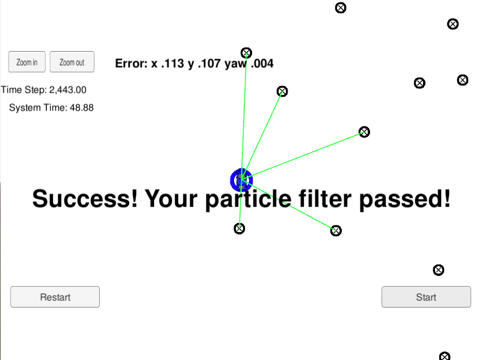
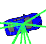

# ParticleFilter
Selfdriving Car Engineer Particlefilter
改成基于ROS下的通信协议，发布预测更新后的定位信息。
## Project Introduction
The self-driving car has been kidnapped and transported to a new location! Luckily it has a map of this location, a (noisy) GPS estimate of its initial location, and lots of (noisy) sensor and control data.

The pipeline of this project is like:

## Running the Code

This project involves the Term 2 Simulator which can be downloaded [here](https://github.com/udacity/self-driving-car-sim/releases)

This repository includes two files that can be used to set up and install uWebSocketIO for either Linux or Mac systems. For windows you can use either Docker, VMware, or even Windows 10 Bash on Ubuntu to install uWebSocketIO.

Once the install for uWebSocketIO is complete, the main program can be built and ran by doing the following from the project top directory.

1. mkdir build
2. cd build
3. cmake ..
4. make
5. ./particle_filter

## Inputs

1. one map with many landmarks(id and position)
2. one initial GPS location
3. landmark observations in each timestamp when self-driving car moving

## Result

In this picture, the Udacity-Car is the ground truth of localization, like

The blue circle with a black arrow inside stands for the best particle of our algorithm, like

